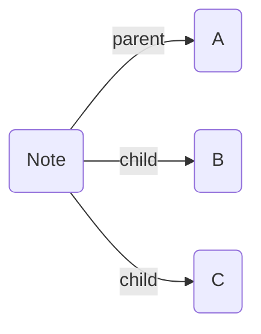

# Breadcrumbs Docs Vault — Code Conventions

## Critical

1. **Never invent Breadcrumbs settings, APIs, or syntax** not present in the existing docs export. `API.md` only documents `window.BCAPI` at a placeholder level — do not fabricate additional API surface.
2. **Terminology is load-bearing.** These terms must be used exactly as defined — never substitute synonyms:
   - `Edge Fields` (not "edge types", "link fields", or "typed fields")
   - `Field Groups` (not "field collections" or "edge groups")
   - `Explicit Edge Builders` (not "explicit edges" when referring to the builder category)
   - `Implied Edge Builders` (not "implicit edges" or "inferred edges")
   - `Transitive Implied Relations` (not "transitive rules" or "chain rules")
   - `Note Attributes` — specifically `BC-ignore-in-edges` and `BC-ignore-out-edges`
   - View names: `Tree View`, `Matrix View`, `Codeblocks`, `Trail View`, `Previous-Next View`
   - Command names: `Rebuild Graph`, `Threading`, `Freeze Crumbs to File`, `Create List Index`, `Jump to First Neighbour`, `Graph Stats`
3. **Internal links always use `[[wikilink]]` syntax** — never bare markdown links (`[text](path)`) between docs pages.
4. **Image embeds use `![[filename.png]]`** — images live in `Images/`. Never use markdown image syntax (``).

## Instructions

### 1. Frontmatter Patterns

Only three frontmatter keys are used across this vault:

| Key | Where used | Values |
|---|---|---|
| `aliases` | `Concepts.md`, `Edge Fields.md`, `Explicit Edge Builders.md`, `Implied Edge Builders.md` | `string[]` — lowercase variants of the page title |
| `BC-folder-note-field` | Folder index pages: `Commands/Commands.md`, `Views/Views.md`, `Suggesters/Suggesters.md`, `Explicit Edge Builders/Explicit Edge Builders.md` | Always `down` |
| (none) | All other pages | No frontmatter at all |

**Rules:**
- Folder index pages MUST have `BC-folder-note-field: down` — this is how Breadcrumbs models the folder→child relationship.
- Only add `aliases` when the page has a well-known alternate form (e.g., `Edge Fields` → `edge fields`, `field`).
- Do NOT add frontmatter to leaf pages (guides, announcements, debugging, etc.) unless they are folder indexes or need aliases.

**Verify:** Check existing pages in the same folder before adding frontmatter. If no sibling has frontmatter, yours probably shouldn't either.

### 2. Page Structure

**Folder index pages** (e.g., `Commands/Commands.md`, `Views/Views.md`, `Guides/Guides.md`):
```md
---
BC-folder-note-field: down
---

Brief one-line description of the category.

- [[Child Page 1]]
- [[Child Page 2]]
```

**Leaf documentation pages** (e.g., `Typed Links.md`, `Rebuild Graph.md`):
- Start directly with prose — no frontmatter unless aliases needed.
- Use `## Heading` for major sections.
- Reference other pages with `[[wikilinks]]` inline.
- End with `---` separator if adding a `next::` chain link.

**Verify:** Every new page in a subfolder must be listed in that folder's index page as a `[[wikilink]]` bullet.

### 3. Wikilink Conventions

All internal references use `[[PageName]]` or `[[PageName|display text]]`:

```md
%% CORRECT %%
See [[Edge Fields]] for more details.
Use the [[Typed Links|typed-link]] edge builder.
Run "Breadcrumbs: [[Rebuild Graph]]".

%% WRONG %%
See [Edge Fields](Edge%20Fields.md) for more details.
```

- Command references in prose use bold + wikilink: `"**Breadcrumbs: [[Rebuild Graph]]**"`
- Cross-references to concept anchors use `[[Concepts#Graph]]`, `[[Concepts#Traversal]]`, `[[Concepts#Edge Attributes]]`.

**Verify:** Run `rg -n '\[.*\]\(.*\.md\)' <file>` — if any matches appear, convert them to wikilinks.

### 4. Image Embeds

All images live in `Images/` and are embedded with:
```md
![[Descriptive Image Name.png]]
```

- Filenames use Title Case with spaces: `Edge Field Settings.png`, `Codeblock Matrix View.png`.
- Place image embeds on their own line, with a blank line before and after.
- Never use markdown image syntax: `` is wrong.

**Verify:** Run `rg -n '!\[.*\]\(' <file>` — if any matches appear, convert to `![[...]]` syntax.

### 5. Mermaid Diagrams

Used to illustrate graph relationships. Always use ` ```mermaid ` fenced blocks:



**Conventions observed in existing docs:**
- Node IDs are numeric: `1(Label)`, `2(Label)`, etc.
- Explicit edges use solid arrows: `-- field -->`
- Implied edges use dotted arrows: `-. field .->`
- Direction is usually `LR` (left-to-right) or `TD`/`LR` for `flowchart`.
- Use `graph LR` for simple chains, `flowchart LR` or `flowchart TD` for more complex diagrams.

**Verify:** Paste the Mermaid block into the [Mermaid Live Editor](https://mermaid.live) to confirm it renders.

### 6. Breadcrumbs Codeblock Examples

When documenting Breadcrumbs codeblock syntax, show the YAML content in a ` ```yaml ` block:

```yaml
type: tree
fields: [down]
depth: [0, 3]
sort: basename asc
```

Key syntax rules (these changed in v4 beta):
- `fields` is a `string[]`: `fields: [up, same]` — NOT comma-separated string.
- `field-groups` is a `string[]`: `field-groups: [ups, downs]`.
- `depth` is a `[number, number]`: `depth: [0, 3]` — NOT `"0-3"` string.
- `show-attributes` is a `string[]`: `show-attributes: [field, source]`.
- `sort` uses format: `<sorter> asc|desc` — e.g., `sort: basename asc`.

**Verify:** Ensure all codeblock YAML examples parse as valid YAML with array syntax, not comma-separated strings.

### 7. Callout Blocks

Use Obsidian callout syntax for tips, examples, and info:

```md
> [!TIP]
> Use the [[Edge Field Suggester]] to speed up adding Dataview typed-links

> [!EXAMPLE]
> A common use-case of graphs is representing personal-connections...

> [!INFO]
> Breadcrumbs lets you add _typed links_ to your notes.
```

Observed callout types: `TIP`, `EXAMPLE`, `INFO`. Do not introduce new callout types without precedent.

### 8. Announcement Page Conventions

Announcement pages in `Announcements/`:
- No frontmatter.
- Start with `## Breadcrumbs 🍞` or `🍞 **Breadcrumbs**` heading/bold intro.
- End with a `---` separator, a Discord message link, and a Dataview inline chain link:

```md
---

Message Link: [Discord](https://discord.com/channels/...)

next:: [[Announcement YYYY-MM-DD]]
```

- The `next::` field chains announcements in reverse-chronological order (newest points to next-newest).
- Announcement filenames: `Announcement YYYY-MM-DD.md`.

**Verify:** The `next::` target must match an existing announcement filename exactly.

### 9. Dataview Inline Fields

Used sparingly — only in two patterns:

1. **Announcement chaining:** `next:: [[Announcement YYYY-MM-DD]]`
2. **Section chaining in Explicit Edge Builders:** `next:: [[Implied Edge Builders]]`
3. **Typed link examples in content:** `parent:: [[Mother]]`

The double-colon `::` syntax is Dataview's inline field format. Always include a space after `::`.

### 10. Horizontal Rules

Use `---` (three dashes, own line, blank lines above and below) as section separators:
- Before `next::` chain links at page bottom.
- Between major conceptual sections within a page.

Do NOT use `***` or `___`.

## Examples

### Adding a new Explicit Edge Builder page

**User says:** "Add documentation for a new 'Link Notes' edge builder."

**Actions:**
1. Create `Explicit Edge Builders/Link Notes.md` with no frontmatter (it's a leaf page).
2. Start with a prose description using `[[wikilinks]]` to reference `[[Edge Fields]]`, `[[Concepts#Graph]]`, etc.
3. Include a `## Settings` section describing configuration options.
4. Add a Mermaid diagram showing the edge relationship using numeric node IDs and solid `-- field -->` arrows.
5. Add the page to `Explicit Edge Builders/Explicit Edge Builders.md` as a new `- [[Link Notes]]` bullet in the list (before the `---` separator).
6. Verify the folder index has `BC-folder-note-field: down` in its frontmatter.

**Result:**
```md
_Link notes_ let you add edges based on existing Obsidian links in your notes.

## How it Works

When a note contains a regular `[[wikilink]]`, Breadcrumbs can automatically create an [[Edge Fields|edge field]] for it.


## Settings

- **Field**: Which [[Edge Fields|edge field]] to assign to detected links
- **Folders**: Optionally limit to notes in specific folders
```

### Adding a new Announcement

**User says:** "Add an announcement for 2024-05-15."

**Actions:**
1. Create `Announcements/Announcement 2024-05-15.md`.
2. Start with `🍞 **Breadcrumbs**` intro.
3. End with `---`, Discord link, and `next::` pointing to the previous latest announcement.
4. Update the previous latest announcement's `next::` to point to this new one (if it was the chain head).

## Common Issues

### Wikilink renders as plain text in preview

**Symptom:** `[[Page Name]]` shows as literal text instead of a clickable link.

**Fix:**
1. Verify the target page exists: `ls "breadcrumbs-docs-vault/Page Name.md"`
2. Check for typos in the page name — it must match the filename exactly (case-sensitive).
3. Ensure no escape characters before the brackets.

### Frontmatter causes Breadcrumbs parsing errors

**Symptom:** "Edge Build Errors" notice after Rebuild Graph.

**Fix:**
1. YAML arrays must use bracket syntax: `aliases: ["edge fields"]` or block syntax.
2. Wikilinks in frontmatter must be quoted: `parent: "[[A]]"` — not `parent: [[A]]`.
3. Multiple values use array syntax: `child: ["[[B]]", "[[C]]"]`.

### Mermaid diagram not rendering

**Symptom:** Raw Mermaid text appears instead of a graph.

**Fix:**
1. Ensure the fence is ` ```mermaid ` (no space before backticks, no extra characters).
2. Verify node syntax uses parentheses: `1(Label)`, not `1[Label]` (square brackets have special meaning in Mermaid).
3. Check arrow syntax: `-->` for directed, `-.->` for dotted. Common mistake: `-- field ->` (missing second dash).

### `next::` chain link not detected by Breadcrumbs

**Symptom:** Announcement or section chaining doesn't appear in the graph.

**Fix:**
1. Ensure Dataview plugin is installed and enabled.
2. Use double colon with space: `next:: [[Target]]` — not `next: [[Target]]` (single colon is frontmatter, not inline).
3. The `next::` line must be in the note body, not inside a codeblock or callout.
4. Run `Breadcrumbs: Rebuild Graph` after adding the field.

### New page not appearing in Tree View / Matrix View

**Symptom:** Added a page to a subfolder but it doesn't show in the hierarchy.

**Fix:**
1. Verify the folder's index page has `BC-folder-note-field: down` in frontmatter.
2. Verify the new page is listed as a `[[wikilink]]` bullet in the index page.
3. Run `Breadcrumbs: Rebuild Graph`.

## Related skills
- `breadcrumbs` — for broader Breadcrumbs workflow routing
- `breadcrumbs-edit` — for actual page updates
- `obsidian-markdown` — for note-structure and markdown syntax guidance
- `obsidian-yaml-frontmatter` — for frontmatter formatting details
