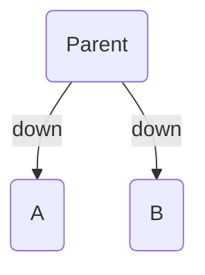
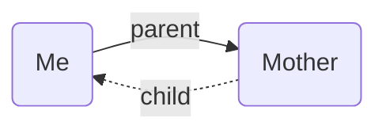
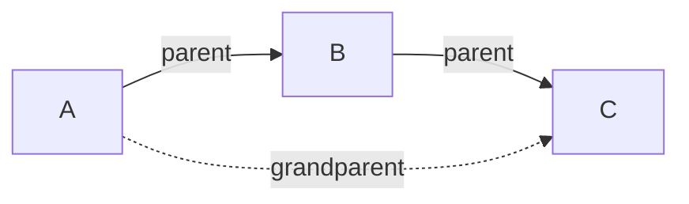

# Breadcrumbs Docs Editing

## Critical

- **No H1 headings in page body.** The page title is derived from the filename. Start body content with a short intro paragraph or directly with `##` sections.
- **Never invent Breadcrumbs settings, syntax, or API features.** Only document what exists in the vault export at `breadcrumbs-docs-vault/`. If unsure, search the vault before writing.
- **Terminology is sacred.** Use exact terms: "Edge Fields" (not "edge types"), "Field Groups" (not "field categories"), "Explicit Edge Builders" (not "edge sources"), "Implied Edge Builders" (not "inferred edges"), "Transitive Implied Relations" (not "transitive rules"). When in doubt, check `breadcrumbs-docs-vault/CLAUDE.md` for the terminology table.
- **Wikilinks only between docs pages.** Never use bare markdown links (`[text](path)`) for internal cross-references. Always use `[[Page Name]]` or `[[Page Name|display text]]`.

## Instructions

### 1. Determine the page type

Before writing or editing, identify which type of page you're working on:

| Type | Frontmatter | Body pattern | Examples |
|---|---|---|---|
| **Folder index** | `BC-folder-note-field: down` | Intro sentence + bullet list of `[[child pages]]` | `Commands/Commands.md`, `Views/Views.md`, `Suggesters/Suggesters.md` |
| **Concept/reference page** | `aliases:` array (optional) | Intro paragraph, `##` sections, Mermaid diagrams, examples | `Edge Fields.md`, `Concepts.md`, `Field Groups.md` |
| **Feature page** | Optional `aliases:` | Explanation + `## Settings` section + examples | `Explicit Edge Builders/Date Notes.md`, `Explicit Edge Builders/Folder Notes.md` |
| **Guide** | None typically | `## Steps` with numbered `### N. Step Name` subsections + `## Extras/Advanced Usage` | `Guides/Layered Daily Notes.md`, `Guides/Personal Relationship Management.md` |
| **Announcement** | None | `## Breadcrumbs 🍞` heading, changelog-style | `Announcements/Announcement 2024-04-25.md` |

Verify you have the correct type before proceeding.

### 2. Set up frontmatter

Apply the correct YAML frontmatter based on page type:

**Folder index pages** — use `BC-folder-note-field: down`:
```yaml
---
BC-folder-note-field: down
---
```

**Pages with aliases** — use an array:
```yaml
---
aliases:
  - edge fields
  - field
---
```

**Folder index with aliases** — combine both:
```yaml
---
BC-folder-note-field: down
aliases:
  - explicit
---
```

**Pages with no special metadata** — omit frontmatter entirely (no empty `---` blocks). Examples: `Home.md`, `Note Attributes.md`, `Debugging.md`, most guide pages.

Verify: frontmatter uses only documented fields (`BC-folder-note-field`, `BC-folder-note-recurse`, `aliases`, or Breadcrumbs edge fields like `up`, `parent`, `month`). Never add `title`, `tags`, `date`, or other non-Breadcrumbs fields.

### 3. Write the body content

Follow these formatting rules exactly:

**Headings:** Use `##` for top-level sections, `###` for subsections, `####` sparingly. Never use `#` (H1).

**Wikilinks:** Always use `[[Target Page]]` for cross-references. Use `[[Target Page|display text]]` when the link text should differ. Common patterns:
- `[[Edge Fields|edge field]]` — lowercase alias in running text
- `[[Rebuild Graph|rebuild the graph]]` — verb phrase alias
- `[[Concepts#Graph|Breadcrumbs graph]]` — section anchor with alias
- `[[Typed Links#Frontmatter Links|frontmatter links]]` — sub-section anchor

**Image embeds:** Use `![[image-name.png]]`. Images are stored in `Images/`. Use descriptive PascalCase or space-separated names matching existing conventions:
- `![[Edge Field Settings.png]]`
- `![[Codeblock Mermaid Binary Tree.png]]`
- `![[transitive (parent, parent) -> grandparent.png]]`

**Callouts/admonitions:** Use Obsidian callout syntax with these types (observed in vault):
```markdown
> [!INFO]
> Informational note.

> [!TIP]
> Helpful suggestion.

> [!EXAMPLE]
> Concrete example with details.

> [!NOTE]
> Supplementary context.

> [!IMPORTANT]
> Critical warning or constraint.
```

**Inline Dataview fields:** Place at the bottom of the page, after a `---` horizontal rule:
```markdown
---

next:: [[Target Page]]
```

This pattern is used for navigation between sequential pages (see `Explicit Edge Builders/Explicit Edge Builders.md`).

**Lists:** Use `-` (unordered) for feature lists, bullet points, and child page lists. Use numbered lists only inside guide step sections.

**Horizontal rules:** Use `---` to separate major sections (e.g., before `next::` fields, between conceptual breaks).

Verify: no H1 headings, no bare markdown links between docs pages, all image embeds use `![[]]` syntax.

### 4. Write Mermaid diagrams

Mermaid diagrams illustrate graph relationships. Follow these exact patterns from the vault:

**Simple directional graph:**


**Multi-child edges:**


**Explicit vs implied edges** (implied uses dotted lines):


**Chain/transitive visualization:**


Conventions:
- Use `flowchart` or `graph` (both appear in vault)
- Directions: `LR` (left-right), `TD`/`BT` (top-down/bottom-up) based on semantic direction
- Node IDs: use numbers (`1`, `2`, `3`) or short labels (`A`, `B`, `C`)
- Node labels in parentheses: `1(Note Name)`
- Edge labels: `-- field -->` or `-->|field|` (both patterns used)
- Implied edges: `-. field .->` or `-.->|field|`

Verify: Mermaid syntax renders correctly, edge field names match existing [[Edge Fields]].

### 5. Write code examples

Use the correct fenced code block language for each context:

**YAML frontmatter examples** — use ` ```yaml ` with full `---` delimiters:
```yaml
---
parent: "[[A]]"
child: ["[[B]]", "[[C]]"]
---
```

**Markdown content examples** — use ` ```md `:
```md
parent:: [[A]]
child:: [[B]], [[C]]
```

**Breadcrumbs codeblock examples** — use ` ```yaml ` and describe it as a `breadcrumbs` codeblock in surrounding text:
```yaml
type: tree
fields: [down]
depth: [0, 3]
sort: basename asc
```

**TypeScript type signatures** (for documenting codeblock fields) — use ` ```ts `:
```ts
type?: (tree) | mermaid
```
Parentheses around `(tree)` indicate the default value.

**JavaScript** (API examples) — use ` ```javascript `:
```javascript
window.BCAPI;
```

**Settings references** — use the format: `Settings > Section > Sub-section` or backtick-quoted names inline.

Verify: code blocks use the correct language tag, YAML frontmatter examples include `---` delimiters, Dataview inline fields use `::` syntax.

### 6. Write guide pages

Guides follow a specific structure. Use this template:

```markdown
This guide will show you how to [goal]. The end result will [benefit].

[Mermaid diagram showing the end-state structure]

## Steps

### 1. [Step Name]

[Explanation with wikilinks to relevant concepts]

[Code example or screenshot]

### 2. [Step Name]

[Continue pattern...]

## Extras/Advanced Usage

### [Advanced Topic]

[Additional tips and variations]
```

Key patterns from existing guides:
- Open with a plain-English summary and a Mermaid diagram of the end state
- Use `## Steps` as the container heading, then `### N. Step Name` for each step
- Reference settings paths: "Go to Breadcrumbs Settings" → "Toggle X using `Edge Source > Date Notes > Enable`"
- End with `## Extras/Advanced Usage` for optional enhancements
- Include `> [!TIP]` callouts for bulk-add rules and shortcuts

Verify: steps are numbered with H3, guide has an intro Mermaid diagram, advanced section exists if applicable.

### 7. Update folder index pages

When adding a new page to a folder, update the corresponding index:

1. Open the folder's index file (e.g., `Commands/Commands.md`, `Views/Views.md`)
2. Add the new page as a `- [[New Page]]` bullet item in the appropriate position
3. Ensure the index has `BC-folder-note-field: down` in frontmatter

Example index structure (`Commands/Commands.md`):
```markdown
---
BC-folder-note-field: down
---

Breadcrumbs adds a few commands to the command palette.

- [[Rebuild Graph]]
- [[Jump to First Neighbour]]
- [[Freeze Crumbs to File]]
- [[Create List Index]]
- [[Threading]]
- [[Graph Stats]]
```

Verify: the new page is listed in the parent index, and the index has correct frontmatter.

### 8. Validate cross-references

After editing, check that:

1. All `[[wikilinks]]` point to existing pages. Run:
   ```bash
   rg -n '\[\[' breadcrumbs-docs-vault/YOUR_FILE.md
   ```
2. All `![[image.png]]` embeds reference files in `Images/`. Run:
   ```bash
   ls breadcrumbs-docs-vault/Images/ | grep -i 'partial-name'
   ```
3. No orphaned pages exist (every non-index page is linked from at least one other page)
4. Terminology matches the canonical terms in the vault's `CLAUDE.md` terminology table

## Examples

### Adding a new guide page

**User says:** "Add a guide for using Breadcrumbs with a Zettelkasten workflow"

**Actions:**
1. Create `breadcrumbs-docs-vault/Guides/Zettelkasten Workflow.md` with no frontmatter (guides don't use it)
2. Write intro paragraph + Mermaid end-state diagram
3. Add `## Steps` with numbered `### N.` subsections, referencing [[Edge Fields]], [[Typed Links]], [[Transitive Implied Relations]] etc.
4. Add `## Extras/Advanced Usage` section
5. Update `breadcrumbs-docs-vault/Guides/Guides.md` — add `- [[Zettelkasten Workflow]]` to the bullet list

**Result:** New guide page follows the exact structure of `Layered Daily Notes.md` and `Personal Relationship Management.md`, and is discoverable from the Guides index.

### Editing a feature page to add an example

**User says:** "Add a Mermaid example to the Folder Notes page"

**Actions:**
1. Read `breadcrumbs-docs-vault/Explicit Edge Builders/Folder Notes.md`
2. Add a new `### Example` subsection with a Mermaid diagram using `flowchart TD` and `-- down -->` edge labels
3. Ensure all wikilinks in the example reference real pages (`[[Edge Fields]]`, `[[Rebuild Graph]]`)

**Result:** New example uses `flowchart TD`, numbered node IDs, and edge labels matching existing Mermaid patterns in the vault.

### Creating a new folder index

**User says:** "Create a new section for Integrations"

**Actions:**
1. Create `breadcrumbs-docs-vault/Integrations/Integrations.md` with frontmatter:
   ```yaml
   ---
   BC-folder-note-field: down
   ---
   ```
2. Add intro sentence + bullet list of child pages
3. Link to the new section from `Home.md` or relevant existing pages

## Common Issues

**Mermaid diagram doesn't render — "Parse error":**
1. Check that node IDs don't contain special characters. Use `1(Label)` not `my-node(Label)`
2. Ensure edge syntax is correct: `-->|label|` or `-- label -->`, not `--label-->`
3. Verify the direction keyword is valid: `LR`, `RL`, `TD`, `TB`, `BT`

**Wikilink shows as plain text in Obsidian:**
1. The target page doesn't exist. Check filename matches exactly (case-sensitive)
2. If linking to a section: `[[Page#Section]]` — verify the heading exists with exact capitalization

**`BC-folder-note-field` not creating edges:**
1. The field value must be a valid Edge Field configured in settings. Verify: `rg -n 'BC-folder-note-field' breadcrumbs-docs-vault/`
2. The note must be in the same folder as the pages it should link to
3. Run [[Rebuild Graph]] after changes

**Frontmatter YAML parsing error:**
1. Wikilinks in frontmatter must be quoted: `parent: "[[Note]]"` not `parent: [[Note]]`
2. Arrays use bracket syntax: `child: ["[[A]]", "[[B]]"]`
3. `BC-folder-note-field` value should not be quoted if it's a simple word: `BC-folder-note-field: down`

**Inline Dataview field not detected by Breadcrumbs:**
1. Must use `::` (double colon), not `:` (single colon)
2. Must be on its own line: `next:: [[Page]]`
3. Requires the Dataview plugin to be installed and enabled
4. Run [[Rebuild Graph]] after adding inline fields

**Image embed `![[image.png]]` shows broken link:**
1. Verify the image exists: `ls breadcrumbs-docs-vault/Images/`
2. Filename is case-sensitive — `![[my Image.png]]` won't match `my image.png`
3. Don't include the `Images/` path prefix — Obsidian resolves by filename: `![[image.png]]` not `![[Images/image.png]]`

## Related skills
- `breadcrumbs` — for multi-step Breadcrumbs docs tasks
- `breadcrumbs-terminology` — to keep terms canonical while editing
- `breadcrumbs-code-conventions` — to keep docs formatting aligned with the vault
- `obsidian-markdown` — for Obsidian markdown syntax details
- `obsidian-links` — for wikilink integrity checks
