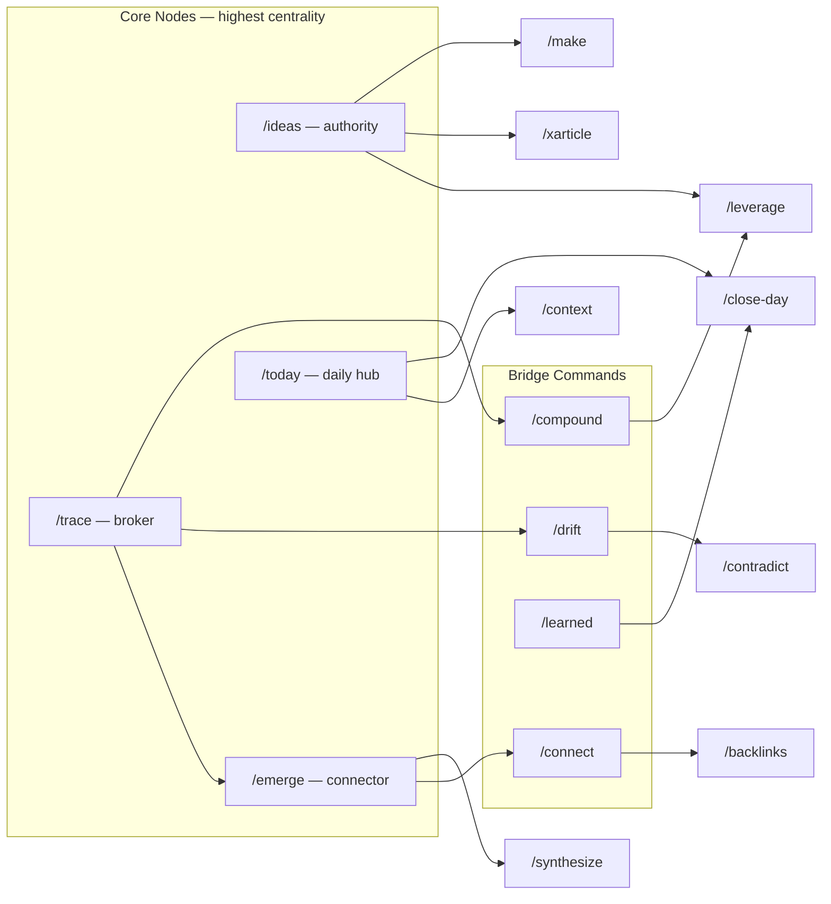
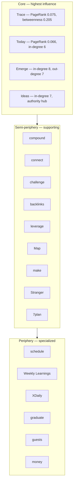

A collection of vault commands for use with [[Obsidian]] and [[Claude Code]], or any agent. Each command reads from the vault in real time — daily notes, context files, and linked thinking.

Commands work best with the [Obsidian CLI](https://help.obsidian.md/cli) installed. Some integrate with Google Calendar, Google Tasks, and Gmail via MCPs. Adjust to suit your own setup.

Personal details have been removed. Prompts use placeholders like `<Company-Context>` and `<Project-Context>`.

## Command Pipeline

Commands form a pipeline from raw vault data to strategic decisions. Each layer feeds the next.

```mermaid
graph TD
    subgraph Grounding ["Grounding — establish context"]
        context["/context"]
        today["/today"]
        close-day["/close-day"]
        schedule["/schedule"]
        plan7["/7plan"]
    end

    subgraph Discovery ["Discovery — find what's in the vault"]
        map["/map"]
        emerge["/emerge"]
        connect["/connect"]
        backlinks["/backlinks"]
        graph_cmd["/graph"]
    end

    subgraph Reflection ["Reflection — challenge and deepen"]
        ghost["/ghost"]
        trace["/trace"]
        challenge["/challenge"]
        contradict["/contradict"]
        stranger["/stranger"]
        compound["/compound"]
        drift["/drift"]
    end

    subgraph Synthesis ["Synthesis — combine, score, promote"]
        synthesize["/synthesize"]
        audit["/audit"]
        ideas["/ideas"]
        graduate["/graduate"]
    end

    subgraph Output ["Output — produce deliverables"]
        learned["/learned"]
        weekly["/weekly-learnings"]
        make["/make"]
        xdaily["/xdaily"]
        xarticle["/xarticle"]
    end

    subgraph Strategy ["Strategy — big-picture decisions"]
        money["/money"]
        leverage["/leverage"]
        guests["/guests"]
        evolve["/evolve"]
    end

    Grounding --> Discovery
    Discovery --> Reflection
    Reflection --> Synthesis
    Synthesis --> Output
    Synthesis --> Strategy
    Output --> Strategy
```

## Cross-Category Relationships

Commands don't just flow top-down. The graph analysis reveals non-linear relationships across the pipeline:

## Grounding

Commands for establishing context and planning. These read the vault to build a picture of what's happening now.

| Command | What It Does | Prompt |
| --- | --- | --- |
| `/context` | Reads across the vault to build a full picture of who you are, what you're working on, and what you care about right now | [[Prompt - Context]] |
| `/today` | Pulls from recent notes, calendar, and open threads to generate a daily plan grounded in what's actually happening | [[Prompt - Today]] |
| `/close-day` | Reviews what happened today, captures what you learned, and flags anything unresolved for tomorrow | [[Prompt - Close Day]] |
| `/schedule` | Schedules events by reading your priorities, commitments, and energy patterns from the vault, not just calendar gaps | [[Prompt - Schedule]] |
| `/7plan` | Looks at what's most alive in your thinking right now and reshapes the next 7 days around it | [[Prompt - 7plan]] |

## Discovery

Commands for structural analysis and finding what's hidden in the vault.

| Command | What It Does | Prompt |
| --- | --- | --- |
| `/map` | Generates a topological view of everything in the vault, showing clusters, themes, and how ideas relate | [[Prompt - Map]] |
| `/emerge` | Finds ideas you've never explicitly written but that are strongly implied by patterns across multiple notes | [[Prompt - Emerge]] |
| `/connect` | Surfaces unexpected bridges between unrelated domains in the vault that you haven't noticed | [[Prompt - Connect]] |
| `/backlinks` | Finds notes that should be linked but aren't and wires new connections across the vault | [[Prompt - Backlinks]] |
| `/graph` | Quantitative graph analytics on the vault's link topology — centrality, community detection, and core-periphery analysis | [[Prompt - Graph]] |

## Reflection

Commands for challenging, tracing, and deepening your thinking. These use the vault as a mirror.

| Command | What It Does | Prompt |
| --- | --- | --- |
| `/ghost` | Answers any question as you by reading your notes, beliefs, and writing style from the vault | [[Prompt - Ghost]] |
| `/trace` | Takes an idea and tracks how your thinking about it changed over weeks or months through daily notes | [[Prompt - Trace]] |
| `/challenge` | Reads your current thinking on a topic and argues against it using evidence from your own vault | [[Prompt - Challenge]] |
| `/contradict` | Finds places where you hold two incompatible beliefs at the same time across different notes | [[Prompt - Contradict]] |
| `/stranger` | Reads the entire vault and writes a portrait of you as if from someone who's never met you | [[Prompt - Stranger]] |
| `/compound` | Asks the same question at different points in time across the vault to show how context compounds | [[Prompt - Compound]] |
| `/drift` | Identifies topics, projects, or commitments you've been quietly avoiding based on gaps in your notes | [[Prompt - Drift]] |

## Synthesis

Commands for combining, scoring, and promoting ideas. These take raw discovery and reflection and make it actionable.

| Command | What It Does | Prompt |
| --- | --- | --- |
| `/synthesize` | Weaves multiple vault threads into coherent narratives by finding convergences across active themes | [[Prompt - Synthesize]] |
| `/audit` | Vault structural health check combining backlink analysis, readiness scoring, and a prioritized action plan | [[Prompt - Audit]] |
| `/ideas` | Generates new ideas by reading current projects, interests, and open questions across the vault | [[Prompt - Ideas]] |
| `/graduate` | Extracts ideas buried in daily notes and promotes them into standalone permanent notes | [[Prompt - Graduate]] |

## Output

Commands for producing deliverables from vault material.

| Command | What It Does | Prompt |
| --- | --- | --- |
| `/learned` | Turns recent learnings from the vault into a polished "What I Learned" post | [[Prompt - Learned]] |
| `/weekly-learnings` | Compiles the week's insights from daily notes into a single writing-ready summary | [[Prompt - Weekly Learnings]] |
| `/make` | Finds ideas in the vault that have matured enough to become something real, scores their readiness, and suggests what form each could take | [[Prompt - Make]] |
| `/xdaily` | Pulls X/Twitter posts and threads them into the relevant daily notes | [[Prompt - XDaily]] |
| `/xarticle` | Scans the vault for topics with graph density, current energy, and synthesis potential to find what to write for the next X Article | [[Prompt - XArticle]] |

## Strategy

Commands for big-picture decisions about money, leverage, and direction.

| Command | What It Does | Prompt |
| --- | --- | --- |
| `/money` | Reads the vault to surface how you could be making money, diagnoses what's broken in your revenue system, and recommends specific opportunities | [[Prompt - Money]] |
| `/leverage` | Scans the vault to find the 3-7 skills, knowledge domains, or mental models where concentrated investment would produce disproportionate breakthroughs across multiple domains simultaneously | [[Prompt - Leverage]] |
| `/guests` | Derives who you should be talking to on the show by starting from questions the vault is actively asking, not from a guest pipeline | [[Prompt - Guests]] |
| `/evolve` | Finds ideas at the intersection of readiness and leverage — things both mature enough to act on and strategically important enough to produce disproportionate returns | [[Prompt - Evolve]] |

## Graph Structure

Based on centrality analysis of the full command graph (30 nodes, 104 directed edges):

**Key structural properties:**
- **84.6% reciprocity** — nearly all links are bidirectional
- **51% cross-category** — balanced integration without losing category identity
- **Single connected component** — every command is reachable from every other
- **Trace** is the #1 broker (highest betweenness + PageRank) — connects Reflection to Discovery to Output
- **Ideas** is the #1 authority (highest in-degree) — the most-referenced command across all categories
- **Emerge** is the #1 connector (highest combined degree) — the densest node in the graph
