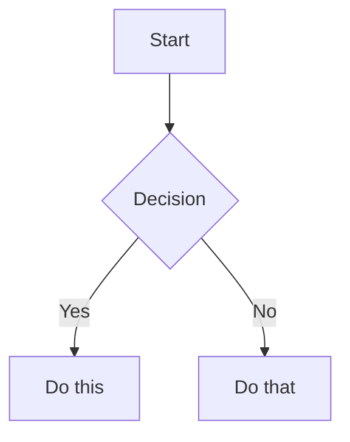

# Obsidian Flavored Markdown

Use this skill for **note content**, not plugin code. It covers Obsidian-specific Markdown behavior that goes beyond normal CommonMark or GitHub Flavored Markdown.

## When to use this skill

Reach for this skill when the user wants to:
- create or rewrite Obsidian notes
- fix note formatting in a vault
- add or repair wikilinks
- add embeds, callouts, tags, or properties
- convert plain Markdown into Obsidian-friendly notes
- make a note render cleanly in reading view

If the task is about `.base` files, `.canvas` files, or vault automation, use the more specific skill for those artifacts instead.

## Default note-writing workflow

1. **Understand the note's job**
   - meeting note, evergreen note, project page, daily note, reference note, etc.
2. **Add properties only when they add real value**
   - title, aliases, tags, dates, status, source, related people/projects
3. **Use standard Markdown for structure**
   - headings, lists, quotes, code fences, tables
4. **Add Obsidian-specific syntax deliberately**
   - wikilinks for internal references
   - embeds for inline reuse
   - callouts for emphasis or reusable structure
   - comments for hidden editorial notes
5. **Validate the final note**
   - frontmatter stays at the top
   - links look correct
   - embeds point to real files/notes
   - reading-view rendering should be clean

## Choose the right construct

| Need | Use | Why |
|---|---|---|
| Link to another note in the vault | `[[Note Name]]` | Obsidian tracks renames and backlinks |
| Link to a heading or block | `[[Note#Heading]]`, `[[Note#^block-id]]` | Preserves deep links inside the vault |
| Link to an external site | `[label](https://...)` | External URLs should stay standard Markdown |
| Show another note or asset inline | `![[...]]` | Embeds render content directly |
| Highlight a warning / tip / info block | callout | Better semantics and readability |
| Store structured note metadata | frontmatter properties | Searchable and reusable across the vault |
| Hide drafting notes from reading view | `%% comment %%` | Keeps working notes out of final rendered content |

## Internal links (wikilinks)

Use wikilinks for anything inside the vault.

```markdown
[[Note Name]]
[[Note Name|Custom Label]]
[[Note Name#Heading]]
[[Note Name#^block-id]]
[[#Heading in this note]]
```

### Block IDs

Attach a block ID to a paragraph:

```markdown
This paragraph can be referenced elsewhere. ^key-idea
```

For list items or quote blocks, put the block ID on its own line after the block:

```markdown
> Important quoted passage.

^quote-id
```

## Embeds

Prefix a wikilink with `!` to render it inline.

```markdown
![[Another Note]]
![[Another Note#Key Section]]
![[image.png]]
![[image.png|320]]
![[document.pdf#page=3]]
```

Use embeds when the user wants reusable content or inline assets, not when a simple reference is enough.

For more embed patterns, read `references/EMBEDS.md`.

## Callouts

Use callouts when information should stand out or be visually grouped.

```markdown
> [!note]
> Basic note callout.

> [!warning] Watch out
> This is a warning with a custom title.

> [!tip]- Optional details
> Foldable callout (`-` collapsed, `+` expanded).
```

Common types include `note`, `tip`, `info`, `warning`, `success`, `danger`, `question`, `example`, `quote`, and `todo`.

For the full callout catalog and nesting behavior, read `references/CALLOUTS.md`.

## Properties (frontmatter)

Put properties at the very top of the note.

```yaml
---
title: Project Alpha
aliases:
  - Alpha
tags:
  - project
  - active
status: in-progress
created: 2026-03-31
---
```

### Property guidance

- Prefer meaningful fields over dumping everything into frontmatter.
- Keep formatting consistent across related notes.
- Use YAML lists for multi-value fields like `tags` and `aliases`.
- If the user asks about detailed property behavior or edge cases, read `references/PROPERTIES.md`.

## Tags

```markdown
#tag
#nested/tag
```

Use inline tags sparingly inside prose. If the note is metadata-heavy, frontmatter tags are often cleaner.

## Comments

```markdown
Visible text %%hidden comment%% more visible text.

%%
This whole block is hidden in reading view.
%%
```

Use comments for editorial guidance or temporary drafting notes that should not appear in rendered output.

## Other Obsidian-friendly syntax

### Highlight

```markdown
==Highlighted text==
```

### Math

```markdown
Inline math: $e^{i\pi} + 1 = 0$

$$
\frac{a}{b} = c
$$
```

### Mermaid

````markdown

````

### Footnotes

```markdown
A sentence with a footnote.[^1]

[^1]: Footnote content.

Inline footnote.^[Short inline note.]
```

## Common mistakes to avoid

- Mixing external URLs into wikilinks instead of using Markdown links
- Putting text before frontmatter
- Referencing headings or blocks that do not exist
- Using embeds where a normal link would keep the note cleaner
- Over-tagging notes with too many low-value tags
- Creating callouts for ordinary text that would read better as normal prose

## Validation checklist

Before finishing, check:
1. frontmatter is valid YAML and stays at the top
2. internal links use wikilinks, external links use Markdown links
3. embeds point to real notes/files
4. callouts are properly quoted line by line
5. headings and lists render cleanly in Obsidian

## Complete example

````markdown
---
title: Project Alpha
tags:
  - project
  - active
status: in-progress
aliases:
  - Alpha
---

# Project Alpha

This project builds on [[Research Notes#Opportunity]].

> [!important] Key deadline
> First milestone is due on ==2026-04-15==.

## Tasks

- [x] Define scope
- [ ] Draft implementation plan
- [ ] Review with team

## Supporting material

See ![[Architecture Diagram.png|640]] for the latest visual.

## Notes

Detailed background lives in [[Project Alpha Background]].
````

## References

- `references/PROPERTIES.md`
- `references/EMBEDS.md`
- `references/CALLOUTS.md`
- https://help.obsidian.md/obsidian-flavored-markdown
- https://help.obsidian.md/links
- https://help.obsidian.md/embeds
- https://help.obsidian.md/callouts
- https://help.obsidian.md/properties
